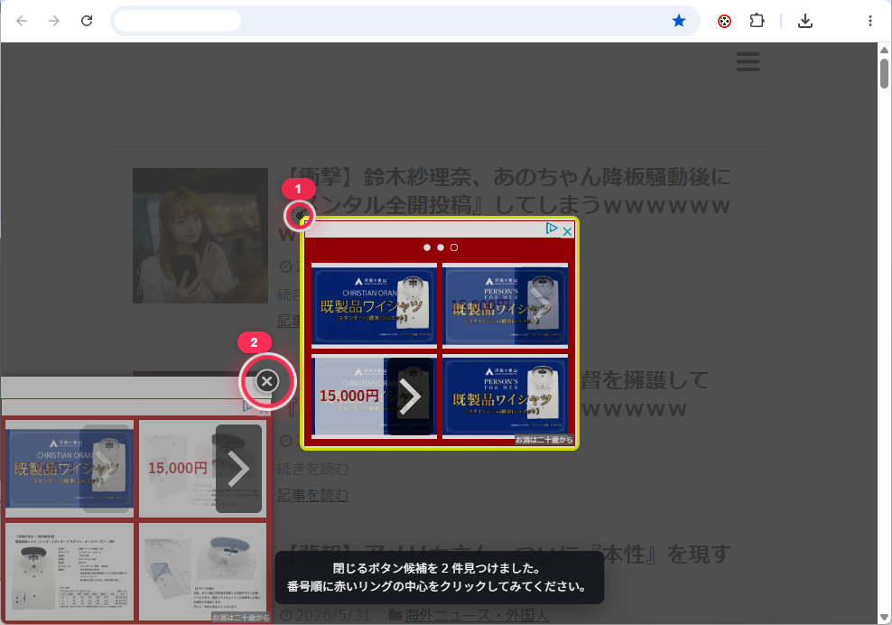

# ×ボタン候補を探す

広告やポップアップの閉じるボタン候補を探し、画面上に赤いリングで表示する Chrome 拡張機能です。

この拡張機能は閉じるボタンを自動クリックしません。表示された候補をユーザーが確認し、必要なものだけクリックします。

## 入手先

通常はChrome ウェブストア版の利用をおすすめします。

Chrome ウェブストア:
https://chromewebstore.google.com/detail/clmpgppinmjonoadlbgkjpjhkodghjlb?utm_source=item-share-cb

GitHub Releasesでは、更新履歴と過去バージョンを確認できます。

https://github.com/bunjicompany/where-is-close-button/releases

## 使い方

1. [Chrome ウェブストア](https://chromewebstore.google.com/detail/clmpgppinmjonoadlbgkjpjhkodghjlb?utm_source=item-share-cb)から「バツどこ？」を追加する
2. 広告やポップアップが出たページを開く
3. Chrome ツールバーの拡張機能アイコンを押す
4. ポップアップ内の「×ボタン候補を探す」を押す
5. 赤い番号付きリングで表示された候補を確認してクリックする

ショートカットは Windows/Linux が `Ctrl+Shift+X`、macOS が `Command+Shift+X` です。

## 機能

- ページ内と iframe 内の閉じるボタン候補を検出
- 候補をクリック順の番号付きリングで表示
- クリック後に候補要素が消えた場合、対応するリングを自動で消去
- 12 秒後に表示を自動で消去

## 注意

これは候補を示す支援ツールです。広告によっては偽のボタン、遅延表示、画像や CSS で作られた閉じるボタンがあり、必ず正しい候補だけを判定できるわけではありません。

## 権限について

この拡張機能は、ページ上の閉じるボタン候補を探すために、表示中のページ内の要素を確認します。

確認した内容は端末内だけで処理され、外部サーバーには送信しません。
入力内容、Cookie、認証情報、閲覧履歴を収集することもありません。

## 検出できない場合

以下のような閉じるボタンは、検出できない場合があります。

- 画像だけで作られているボタン
- 一定時間後に表示されるボタン
- ページとは別の仕組みで重ねて表示される広告
- 極端に小さいボタン
- 偽の閉じるボタンと本物の閉じるボタンが混在している場合

この拡張機能は、閉じるボタンの候補を見つける支援ツールです。
必ず正しいボタンだけを判定するものではありません。

## よくあるケース

- 候補が複数出る場合があります。番号の若い候補から確認してください。
- この拡張機能は候補を表示するだけで、自動クリックは行いません。

## プライバシー

この拡張機能は、閲覧履歴、ページ内容、クリック情報、個人情報を外部サーバーへ送信しません。詳しくは [PRIVACY.md](PRIVACY.md) を参照してください。
